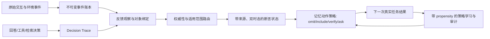

# B 问题研究复盘与收敛方案

## 执行摘要

B 要真正做好，目标必须从“把自然反馈写进记忆，让模型自行变好”收缩为一个可识别、可审计的决策学习问题：**记录某次回答实际使用了哪些记忆、随后收到什么反馈、反馈指向哪个动作或陈述、在什么范围内有效，并学习下一次是否使用、忽略、核验或询问。** 只有未来任务上的净效用提升，才能叫 B 收益；反馈分类更准、摘要更像、检索命中更多、模型更强，都只能是中间证据。

已有工作不是白做。它已经完成了安全 sidecar、失败回退、原始事件保留、来源审计、强基线纪律，并用多条负结果排除了“整段画像 ICL”“答案别名检索”“查询向量残差”“小 K 重排更新”“两例纠正规则”等看似直接的路线。最新 Codex 有界对照也说明，换成更强解释器并不会自动修复范围与变化处理：纠正规则对 frozen 为 1 胜 1 负 1 平，对直接反馈为 1 胜 2 负。<sup>[[1]](#source-1)</sup><sup>[[12]](#source-12)</sup>

真正缺失的是两项基础设施：

1. **决策—反馈因果链。** 当前能知道“用户后来表达了不满”，却通常不知道上一次回答注入了哪条记忆、采用了什么动作、哪个输出片段由其影响，以及未注入时会怎样。
2. **可估计的对照数据。** 历史日志只给被当前策略选择后的结果；未选择的记忆没有结果，未核验的案例没有真值。这是典型的 bandit feedback 与 selective-label 问题，不能用普通监督学习或事后 LLM judge 消除。<sup>[[35]](#source-35)</sup><sup>[[37]](#source-37)</sup>

建议的最短路线不是恢复 30B 下载或继续调 prompt，而是构建一个最小 **B-Core**：不可变事件账本、回答决策轨迹、反馈对象绑定、权威性/适用范围判断、双时态断言库、可逆的记忆使用 gate、结果记录与带 propensity 的小流量随机化。先在有确定环境反馈的代码、SQL 或事务任务中证明“完美归因时反馈确实能改善下一任务”，再逐步替换 oracle 组件；最后才进入自然聊天和个性化偏好。

若这一方案成立，B 的产品形态更接近“带证据的记忆干预策略”，而不是“自动维护的一段用户画像”。

## 1. B 到底是什么

### 1.1 可检验定义

设第 `t` 次决策的上下文为 `x_t`，候选记忆为 `M_t`，系统采取记忆动作 `a_t ∈ {omit, include, verify, ask}`，生成结果 `y_t`，随后观察反馈事件 `f_t` 与任务结果 `r_t`。B 的目标是学习策略：

\[
\pi(a_t\mid x_t,M_t)
\]

使未来期望效用最大：

\[
\mathbb{E}[task\_success - \lambda\,cost - \rho\,unsafe\_change - \gamma\,repeat\_correction].
\]

这里，`f_t` 不是天然的 reward。它必须先经过对象绑定、权威性判断和适用范围判定，才能成为结果证据或状态更新依据。用户说“我希望邮件简短”可以是该用户偏好的强证据；用户说“这个 API 肯定存在”不是客观事实的充分证据；用户重试或沉默只是弱观察。

### 1.2 什么不算 B 成功

- 在当前题上用当前答案或参考答案改好检索，不是跨任务反馈学习。
- 反馈分类 macro-F1 上升，不等于后续回答收益。
- 把完整历史压成规则、摘要或画像，不等于学会了适用边界。
- 新模型胜过弱模型，不等于反馈贡献。
- 端到端 QA benchmark 上升，若没有同证据、同模型、同预算且只有反馈学习机制不同的对照，也不能单独归因给 B。
- 写入成功、可回读、JSON 合法和 fallback 正确，只是运行时合同，不是语义正确性。

可接受的 B 证明应同时满足：固定生成模型；固定可见证据与预算；在未参与选择策略的用户、项目或时间段上；学习策略稳定胜过“无记忆、原话直接使用、确定性范围规则”等强非学习基线；并计入学习、核验、延迟、错误写入和回退成本。这个边界与项目最初“反馈改善后续行为、E 仅作辅助验证”的重新定义一致。<sup>[[2]](#source-2)</sup><sup>[[14]](#source-14)</sup>

## 2. 已有工作的证据账本

| 路线 | 实际结果 | 已证明 | 未证明 / 应吸取的教训 |
|---|---:|---|---|
| 原 PersonaMem 三臂 | 三臂均 10/24 | 旧配置可复现 | 没有回答质量增益；不能再用同一题调 RRF 或 prompt<sup>[[13]](#source-13)</sup> |
| 自然反馈分类 | macro-F1 39.77%→42.61%，17 胜 12 负；会话 bootstrap 区间跨零 | 自然日志含可抽取的反馈行为；温度校准有价值 | 稳定分类增益、记忆归因和下游收益均未证明<sup>[[5]](#source-5)</sup> |
| 后见答案/反馈关联迁移 | 原检索 all 命中 393；直接缓存与反馈别名均 364 | 后见答案能增加当前题词面信息 | 同问绑定不等于未见问题上的可迁移策略，固定 top1+RRF 反而退化<sup>[[6]](#source-6)</sup> |
| 查询残差学习 | learned 与 base 都 418/704，10 胜 10 负 | 冻结 embedding 上可实现共享残差 | 没有净收益；后见可解释方向并非决策前可预测方向<sup>[[7]](#source-7)</sup> |
| reranker 更新 | dense/rerank25/update 为 66/72/70 | 普通 cross-encoder 重排是强基线 | 反馈更新未胜过普通 rerank25，不能把“胜 dense”包装成 B<sup>[[8]](#source-8)</sup> |
| CUPID 原话与摘要 | 原话 719 token，摘要 1432 token | 原始反馈是必要且便宜的强基线 | 生成摘要会增成本、可能丢条件；结构化本身不是贡献<sup>[[9]](#source-9)</sup> |
| CUPID 范围审计 | 同 factor 也可能不适用，异 factor 也可能局部迁移 | 适用性不是 session/factor 等值判断 | 整段画像或单一 `context_factor` 粒度过粗<sup>[[10]](#source-10)</sup> |
| 隔离强能力诊断 | 强助手对本地 4B 为 5 胜 0 负 1 平 | 原证据并非完全不可用，解释能力有上限效应 | 不同算力、无反馈学习，不能当 B 收益<sup>[[11]](#source-11)</sup> |
| Codex 有界四臂 | 12/12 完成；纠正规则对 frozen 1/1/1、对直接反馈 1/2/0 | Codex 链路与 usage 可计量；规则相对直接反馈更省推断输入 | 一个 persona 三题无稳定质量收益；更强解释器仍受对象、范围、变化问题限制<sup>[[12]](#source-12)</sup> |
| MemoryCore feedback sidecar | 选择、超时、非法输出与回退合同已覆盖 | 可以安全承载后续 shadow 实验 | 它只处理宿主提供的候选与 checker 失败项，不负责发现、学习、持久写入或因果归因<sup>[[4]](#source-4)</sup> |

这些结果共同否定的不是“反馈学习可能存在”，而是一个更具体的假设：**只要把历史反馈以更好的文本表示塞回模型，未来行为就会稳定改善。** 现有结果显示，表示、模型能力和检索都可能改善局部组件，但它们无法自行回答“该反馈究竟约束什么、现在是否仍适用、应改变哪个动作”。完整实验与停止条件已经保存在研究账本中。<sup>[[3]](#source-3)</sup>

## 3. 失败的根因

### 3.1 六个命题被压成了一个标签

过去许多流程把下面六件事同时交给一次 LLM 生成或一个 `feedback=true` 标签：

1. 发生了反馈行为；
2. 反馈指向某个回答、动作、工具调用或记忆；
3. 反馈内容在对应命题上具有权威性；
4. 它在当前用户、任务、时间和对象范围内适用；
5. 原失败确由某次记忆使用或缺失造成；
6. 按反馈更新后会改善未来任务。

前一项成立不推出后一项成立。来源 ID 能证明“这句话来自谁”，不能证明“这句话是真的”；reference 覆盖某要求，不能证明用户本轮明确要求它；回答改变了，也不能证明改变由正确记忆导致。B 必须为这些命题分别保留状态与不确定性，允许 `unknown`，而不是强制合成完整画像。

### 3.2 缺少动作级信用分配

一次回答可能同时使用检索、记忆、工具、system prompt 和模型先验。若日志只保存最终 prompt 和最终反馈，就无法知道哪个记忆造成了好坏。TextGrad 把复杂系统写成可追踪的计算图；Agent Lightning 把真实 agent harness 的交互转成轨迹和训练样本。二者真正值得借鉴的不是其优化算法，而是**先暴露可归因节点，再谈学习**。<sup>[[26]](#source-26)</sup><sup>[[27]](#source-27)</sup>

项目自己的 SDPO 路线审查也得到同一边界：对同一 completion 做 token-level 后见反馈，并不会自动给出“哪次记忆使用动作应该被奖励”；若没有真实 action—answer—feedback 链和动作概率，就无法把这种反馈合法迁移成记忆策略更新。<sup>[[15]](#source-15)</sup>

### 3.3 历史日志没有反事实

系统只看到已采取动作的结果。例如记忆被注入后用户纠正了回答，并不能告诉我们“不注入会更差还是更好”；系统未触发核验时，也没有可供监督的真值。Counterfactual Risk Minimization 用 logging propensity 处理这种带选择的反馈；IPS、DR 和 SWITCH 则在不同模型假设下权衡偏差和方差。没有动作概率和覆盖度，离线重放最多是相关性诊断。<sup>[[35]](#source-35)</sup><sup>[[36]](#source-36)</sup>

### 3.4 偏好会变，而且是条件化的

“喜欢详细解释”可能只适用于学习任务；“房产文案要专业”可能在家庭导向场景中变成强调生活方式。CUPID 审计已经实证同 factor 不保证适用、异 factor 也不保证不适用。PRELUDE 也把用户编辑建模为随上下文变化、可能非平稳且部分可观测的偏好；Bayesian online changepoint detection 提供了检测状态突变的经典机制。<sup>[[10]](#source-10)</sup><sup>[[19]](#source-19)</sup><sup>[[39]](#source-39)</sup>

因此，状态单元不能是“用户永久画像”，而应是：

`subject + predicate + value + object/task scope + valid time + recorded time + source + strength + status`。

### 3.5 代理指标压过了强基线

已有实验多次出现“比弱基线好、比普通强基线差”：反馈 reranker 胜 dense 但败给普通 rerank25；共享 query 更新产生少量胜例却净值为零；强模型无需学习就能更好理解相同证据。这说明 B 的增量必须相对**同模型、同信息的最佳非学习利用方式**计算，而不能相对一个故意贫弱的 baseline。

### 3.6 评测单位不独立

同一 persona 的多题、同一会话的多事件、同一来源的多检查点高度相关。把题目数直接当独立样本会夸大确定性。后续统计单位应至少是用户/persona、项目或时间段；成对 bootstrap 或随机化也应在该层进行。

## 4. 相关开源与相邻研究：能借什么，不能借什么

### 4.1 记忆基础设施

**Graphiti** 明确保留 validity window、原始 episode provenance、历史失效而非删除，并支持双时态追踪。这正好对应 B 的“原始证据不可变、派生断言可失效”需求。<sup>[[30]](#source-30)</sup> 但没有必要一开始引入完整图数据库；先在现有存储中实现同样的数据合同，规模或多跳关系真正需要时再迁移。

**LangMem** 区分对话热路径中的记忆工具与后台抽取/合并管理器，并允许 agent 自己决定何时存储。<sup>[[28]](#source-28)</sup> 可借其 hot-path/background 分层；不能把“agent 决定何时写”当成正确性保证。B 的持久写必须由证据等级和策略 gate 控制。

**Mem0** 提供成熟的增加、检索与集成形态，但其当前 README 明确提示：公开 benchmark 的托管栈包含 OSS SDK 没有的专有优化；最新方案也转向 ADD-only、保留历史而非覆盖。<sup>[[29]](#source-29)</sup> 这支持“追加原始事实、不要让 LLM 任意覆盖”的方向，也意味着不能直接拿其托管分数替代本项目验证。

**OpenTelemetry 与 W3C PROV** 是看似不属于记忆研究、却最应直接复用的相邻领域。OpenTelemetry span 原生包含不可变 trace/span ID、父子关系、链接和带时间事件；PROV-O 则用 Entity、Activity、Agent 及影响/派生关系表达跨系统 provenance。<sup>[[40]](#source-40)</sup><sup>[[41]](#source-41)</sup> 它们解决“发生了什么、谁由谁派生”，不解决语义真值；这恰好符合 B 对 provenance 和 truth 分离的要求。

### 4.2 语言反馈与自我改进

**Reflexion、Voyager、ExpeL** 都能把过去结果变成文字反思、技能或跨任务经验。其共同优势是反馈相对落地：程序有测试、Minecraft 有环境执行与错误、任务轨迹有 reward。<sup>[[21]](#source-21)</sup><sup>[[22]](#source-22)</sup><sup>[[23]](#source-23)</sup> 应借用的是“有界 episode、真实结果、经验版本和重放”；不应借用的是“模型写出的反思天然正确”。

**GEPA、ACE** 展示了提示词/上下文候选的生成、反思、筛选、增量合并与防止 context collapse 的做法。<sup>[[24]](#source-24)</sup><sup>[[25]](#source-25)</sup> 它们适合 B 已有可信评分器和独立验证集之后，用来优化解释或规则候选；在此之前运行开放式演化，只会更快过拟合错误代理。

**Agent Lightning** 的真实 harness 轨迹捕获和训练/执行解耦值得参考，但完整 RL 栈不是第一阶段所需。先把 `decision_id → memory action → output → environment result → feedback` 记录完整；只有当轻量 gate 已显示 oracle 上界和真实增益后，才考虑训练生成策略。<sup>[[27]](#source-27)</sup>

### 4.3 自然反馈与个性化

自然反馈研究给出了两条看似矛盾、实际互补的证据。WildFeedback 从多轮日志中识别反馈并构造 preferred/dispreferred 对，报告了对齐收益；另一项 EMNLP 研究发现，反馈内容在短、人工设计任务上有帮助，但在更长、更复杂的 WildBench 上结果混合。<sup>[[16]](#source-16)</sup><sup>[[17]](#source-17)</sup> 结论不是“自然反馈无用”，而是其最稳妥的第一用途是**行为与偏好候选发现**，不是直接生成事实真值或记忆归责标签。

Coactive Learning 更准确地界定了用户编辑：`edited` 只需被视为优于 `original`，不必是假定的 gold answer。<sup>[[18]](#source-18)</sup> PRELUDE 进一步以编辑成本为连续在线目标，并用上下文检索偏好描述；Personalized-RLHF 则明确区分不同用户的偏好分布。<sup>[[19]](#source-19)</sup><sup>[[20]](#source-20)</sup> 对 B 的直接启示是：

- 用户编辑可形成 `edited ≻ original` 的个人偏好对；
- 这对证据不能自动转成“某条客观记忆应被更新”；
- 未点击、未编辑或未投诉不是高置信负反馈。隐式推荐研究长期把行为视为带不同 confidence 的偏好信号，而不是明确 dislike。<sup>[[42]](#source-42)</sup>

### 4.4 检索反馈

CONQRR 用明确的 retrieval reward 训练对话查询改写，说明“直接优化检索目标”在标签可定义时是可行的。<sup>[[34]](#source-34)</sup> 本项目的查询残差和 reranker 更新没有稳定增量，关键差别不是算法新旧，而是监督信号：后见答案揭示相关词，不一定告诉下一任务该向哪里移动。后续若再做检索学习，reward 必须来自真实后续证据命中或任务完成，而不是“被反馈文本提到”。

### 4.5 记忆评测

LongMemEval 将长期记忆拆为抽取、多会话推理、时序推理、知识更新和拒答；MemoryAgentBench 强调准确检索、test-time learning、长程理解和选择性遗忘；HaluMem 又把幻觉定位到抽取、更新和问答三个操作阶段。<sup>[[31]](#source-31)</sup><sup>[[32]](#source-32)</sup><sup>[[33]](#source-33)</sup> 这些 benchmark 适合作为组件回归套件，但都不能替代 B 的因果证明：高 QA 分可能来自更长上下文、更强 reader 或更好检索，而不是历史反馈真的改变了策略。

## 5. 推荐架构：B-Core



### 5.1 不可变事件账本

保存原始 user/assistant/tool/environment 事件、来源、角色、时间和内容 hash。任何摘要、规则或结构化断言只引用 event ID，不覆盖原文。这里沿用现有 native readback、原话保留和来源审计成果即可。

### 5.2 Decision Trace

每次可能受记忆影响的回答都生成 `decision_id`，至少记录：

| 字段 | 含义 |
|---|---|
| `context_id` / `task_id` | 当前任务与作用域 |
| `candidate_memory_ids` | 策略实际看见的候选集 |
| `action` | omit/include/verify/ask；include 时列出选中 ID |
| `policy_version` | 决策规则或模型版本 |
| `propensity` | 在当时日志策略下选择该动作的概率 |
| `prompt_spans` | 哪些记忆进入了哪个 prompt 区段 |
| `output_id` / `tool_call_ids` | 生成与动作结果 |
| `cost` | token、延迟、工具与人工核验成本 |

没有 `candidate set + chosen action + propensity`，就不要把后续日志用于反事实策略学习。

### 5.3 反馈观察与对象绑定

把“有反馈”拆成独立对象：

```text
feedback_claim = {
  observation_type,        # explicit correction / edit / retry / acceptance / implicit
  target_type,             # answer_span / tool_call / memory_assertion / style / unknown
  target_ids,
  claim_text,
  scope,
  authority,
  confidence,
  source_event_ids
}
```

绑定器必须可以 abstain。找不到对象的反馈可保留为 `observation_only`，不能为了覆盖率强行写进画像。对象绑定的 gold 应从可控任务、明确 reply/edit 链和少量人工审计得到，而不是用同一模型生成再评分。

### 5.4 权威性与适用范围路由

| 反馈类型 | 默认权威性 | 默认处理 |
|---|---|---|
| “我偏好/不希望……” | 对该用户偏好较高 | 建立带任务/对象条件的候选偏好，可随时间变化 |
| 用户直接编辑输出 | `edited ≻ original` 较高；编辑文本不是全局 gold | 形成偏好对和编辑成本，不自动改事实库 |
| 单元测试、SQL 执行、交易回执 | 对对应执行结果高 | 绑定到具体 action/tool call，可驱动确定性修复 |
| 用户对外部事实的断言 | 未核验 | 进入 verify 队列，不覆盖已证实事实 |
| retry、停留、点击、沉默 | 低且有混杂 | 仅 observation；累积或随机化后用于弱信号学习 |
| LLM judge 意见 | 代理信号 | 用于筛选/审查，不单独触发持久变更 |

### 5.5 双时态断言库

派生状态采用追加式版本：`valid_from/valid_to` 表示现实中何时有效，`recorded_at/superseded_at` 表示系统何时知道。新证据使旧断言失效，但不删除旧证据。Graphiti 为这种动态知识模型提供了开源实现；项目可先用关系表或 JSONL 实现最小版本。<sup>[[30]](#source-30)</sup>

每条断言还应保留 `support_event_ids`、`contradicts_assertion_ids`、`authority_class`、`scope_predicate` 和 `status={candidate, verified, disputed, expired}`。这样可以撤回派生结论，而不篡改原始会话。

### 5.6 记忆动作策略

第一版只学习一个低容量 gate，不训练大模型权重：

- `omit`：证据无关、过期或风险高；
- `include`：证据与任务范围匹配且预期有益；
- `verify`：价值高但事实权威性不足；
- `ask`：偏好冲突或当前范围不清。

高置信显式规则先行，学习器只处理 residual cases。目标不是预测“用户是否会反馈”，而是预估每个动作的 **expected repair value**：预期任务收益减 token/延迟/核验成本和误写风险。已有 `selectAnswerFeedback` sidecar 可作为影子承载层，但 API 语义应从“选哪个失败候选”扩展为 `observeFeedback`、`selectMemoryAction`、`recordOutcome` 三个独立阶段。

### 5.7 临时干预优先于持久写

单次、低权威或范围不明的反馈只在相关 task/session 建立 temporary intervention。只有满足以下条件之一才提升为持久断言：明确用户自述偏好；可执行环境证据；独立核验；或跨多个相关上下文重复出现并通过变化检测。这样把错误的代价从“污染长期画像”降为“一次可回滚的选择”。

## 6. 学习方案

### 6.1 三阶段学习，而不是一次端到端生成

**阶段 A：组件监督。** 用人工/程序 gold 分别训练或评估 feedback detection、target binding、scope applicability、authority routing。每个头有自己的 abstention 与 precision/coverage 曲线。

**阶段 B：策略 gate。** 在固定候选记忆和固定 reader 下，以 contextual bandit 学 `omit/include/verify/ask`。日志必须保存 propensity，并保证关键动作有 overlap；离线用 IPS/DR/SWITCH，线上只在低风险开发环境做有限探索。<sup>[[35]](#source-35)</sup><sup>[[36]](#source-36)</sup>

**阶段 C：生成或权重优化。** 只有 gate 已证明收益、reward 可复现、独立验证集存在时，才考虑 GEPA/ACE 的规则演化、Agent Lightning 的轨迹 RL 或个性化微调。否则，复杂优化只会放大脏标签。

### 6.2 用户编辑走偏好轨，不走事实轨

对编辑事件存储 `(context, original, edited, edit_distance, user_id, scope)`，把 `edited ≻ original` 作为弱偏好。Coactive learning 的好处是无需假定 edited 是完美答案；PRELUDE 的 edit cost 可作为持续效用指标。<sup>[[18]](#source-18)</sup><sup>[[19]](#source-19)</sup> 若编辑包含事实变化，仍要经过事实核验路由。

### 6.3 非平稳偏好

偏好断言不做永久多数投票。采用时间衰减、最近证据权重和 change-point 状态；检测到突变时并存旧/新版本，当前策略优先新状态但保留历史查询能力。不要用一个全局 `confidence` 同时表示来源可靠性、适用概率和新鲜度。

### 6.4 为什么暂时不训练大模型

本项目当前瓶颈不是参数容量：强隔离助手能更好使用相同证据，但 Codex 的纠正规则仍无稳定增量。<sup>[[11]](#source-11)</sup><sup>[[12]](#source-12)</sup> 这说明先把决策变量、对象和 reward 定义清楚，比扩大基座更有信息价值。等轻量策略显示稳定增量，再决定训练哪一层，能避免把模型成本混进 B 机制收益。

## 7. 评测设计

### 7.1 分层测量

| 层 | 主问题 | 建议指标 |
|---|---|---|
| 观察 | 是否真的发生反馈行为 | precision、coverage、abstention |
| 绑定 | 指向哪个 answer span/action/memory | exact/partial link accuracy，unknown precision |
| 权威性 | 谁对什么有决定权 | 分类型 precision，错误提升率 |
| 范围 | 在新任务是否适用 | pairwise applicability、变化/不变化双向准确率 |
| 更新 | 状态是否安全演化 | false overwrite、正确失效、历史保留 |
| 使用 | 下一决策是否选对动作 | action regret、calibration、verify/ask 效率 |
| 效用 | 后续行为是否改善 | task success、重复纠正率、编辑成本、失败严重度、总成本 |

MemoryAgentBench 与 HaluMem 的分操作思路可用于前六层回归，但第七层必须来自项目自己的顺序交互和对照。<sup>[[32]](#source-32)</sup><sup>[[33]](#source-33)</sup>

### 7.2 必须保留的臂

1. **No-memory**：完全不使用历史。
2. **Raw-event**：检索并直接提供原话，不做学习。
3. **Deterministic scoped memory**：人工规则做范围与权威路由。
4. **B learned gate**：只改变记忆动作策略。
5. **Oracle binder/scope**：给出完美对象与范围，测可达到的上界。
6. **Shuffled/irrelevant feedback**：负控制，检查模型是否只是因更多文字或风格提示得分。

模型、解码、可见事实、token 上限和 evaluator 全部固定。若 learned 只胜 no-memory，却不胜 raw/deterministic，不能宣布 B 成功。

### 7.3 数据切分

- feedback collection、policy selection 和 final evaluation 三层完全分开；
- 按用户/persona、项目、来源 cluster 和时间切分，而不是随机拆题；
- 当前题答案、reference、pair 元数据只进入 evaluator，不进入推断；
- 一次任务中的多个检查点按同一 cluster 统计；
- 所有失败、截断、unknown 和成本保留，不删难题后报分。

### 7.4 反事实与在线估计

开发 harness 中对低风险记忆动作做预先声明的小比例随机化，例如同一 eligibility stratum 下 `include/omit` 各有非零概率，并保存该概率。历史确定性日志的 propensity 为 1 时，只能评价其实际策略，不能可靠评价从未执行的动作。离线先用 replay/IPS/DR/SWITCH 给出估计与有效样本量，再用 shadow/canary 验证。

DAgger 的相邻教训也适用：策略改变会改变它未来遇到的状态分布；只在旧策略数据上训练，部署后可能出现累积误差。<sup>[[38]](#source-38)</sup> 因此每个策略版本要保留独立时间窗，不能把多轮策略产生的数据当 i.i.d. 样本混合。

### 7.5 建议验收线

以下是工程默认线，不是文献中的普适常数，应按业务风险调整：

- Oracle include/omit 在至少两个有确定结果的任务域上相对 raw/no-memory 有正的 cluster-bootstrap 下界；否则停止该数据源或反馈定义。
- 持久写入路径在人工/程序 gold 上 precision ≥95%；达不到时只允许 temporary 或 verify/ask。
- B learned gate 相对 deterministic scoped baseline 的主要效用指标提升至少 3 个百分点，95% cluster-bootstrap 下界大于 0，且严重回归率不增加。
- 学习、核验与推断成本全部计入；若收益只能靠显著增加上下文或模型预算获得，单列为模型/信息增益，不计 B 净收益。
- shuffled feedback 不得带来同方向收益；若出现，说明 evaluator 或 prompt 存在泄漏/风格偏差。

## 8. 最有信息价值的下一实验

### B-1：Oracle Attribution Memory Intervention

这是下一项应做的实验，但本报告不自动启动它。

**任务域顺序：** 先代码单测、SQL/数据查询或带明确交易回执的任务；再做可直接编辑的邮件/摘要偏好；最后才做开放聊天。Reflexion、Voyager、CONQRR 成功路线的共同点正是 reward 可由测试、环境或检索结果落地。<sup>[[21]](#source-21)</sup><sup>[[22]](#source-22)</sup><sup>[[34]](#source-34)</sup>

**第一阶段只测“使用价值”：** harness 直接提供正确的反馈对象、范围和 authority，固定一条候选记忆；对下一匹配任务随机选择 include/omit，模型和 prompt 其余部分完全一致。若 oracle 归因下仍无未来收益，就无需训练 binder 或更大模型。

**第二阶段替换 scope：** 保留 oracle target，只让系统判断当前任务是否适用。评测 changing 与 consistent 成对案例，防止“永远不更新”刷高一致性。

**第三阶段替换 target：** 从实际 decision trace 中学习反馈绑定，unknown 可拒绝。只有 target 与 scope 分别过线后才跑端到端。

**第四阶段学习 gate：** 用前述随机日志训练轻量 contextual bandit，对 deterministic scoped baseline 做 held-out 对照。此时才第一次有资格回答“B 是否带来净收益”。

该设计把问题定位得很清楚：

| 结果 | 结论 |
|---|---|
| Oracle 也无收益 | 当前反馈源/任务没有可迁移效用；停止，不调模型 |
| Oracle 有收益，scope 失败 | 重点做上下文适用性，不做摘要 |
| Scope 通过，target 失败 | 重点补 decision trace 与对象绑定 |
| 组件通过，gate 不胜规则 | 规则已经足够；不需要学习器 |
| 离线通过，canary 失败 | 检查 propensity、选择偏差、策略诱导分布和偏好漂移 |

## 9. 实施路线与退出条件

### Phase 0：补日志合同

交付 `decision_trace`、`feedback_claim`、`memory_assertion`、`outcome` 四个 schema；将现有 sidecar 拆为 observe/select/record；提供 replay 检查器，拒绝缺 candidate set、action 或 propensity 的“学习样本”。可直接借 OpenTelemetry 的 trace/span/link 结构，而无需先引入训练框架。<sup>[[40]](#source-40)</sup>

**实现进度（后续明确授权）：** 四类合同、observe/select/record 构造入口、local JSONL store和fail-closed replay已追加到host-neutral sidecar；一条隔离本地host路径已走通真实SQLite L1/FTS、recall bridge字节级prompt暴露及decision→feedback/assertion→outcome重启回放。详见 [topic3-b-feedback-trace-v1/RESULTS.md](topic3-b-feedback-trace-v1/RESULTS.md)。脚本化开发事件满足本Phase的开发退出条件，但不是自然用户或production闭环。随后oracle attribution为include 8/8、omit 0/8，达到进入scope阶段的预设阈值；见 [topic3-b-oracle-attribution-v1/RESULTS.md](topic3-b-oracle-attribution-v1/RESULTS.md)。该结果是信息干预sanity check，不是自动反馈学习收益。

**自然原话候选进展：** 旧公开行为标签直接映射assertion的v1代理评分失败（9/12），源文复核显示三条`NEG_2`实际只是编辑、续写或格式请求，证明行为类别不能直接当记忆更新真值。随后在模型调用前按严格合同预审另一组14条原话，同一固定Codex抽取器得到2/2候选、12/12 abstain；真实candidate gate只接受answer绑定、显式用户权威、当前交互scope及原话span，并以candidate状态写入本地ledger，28 decision/14 claim/2 assertion/14 outcome重启回放通过。详见 [topic3-b-natural-assertion-v1/RESULTS.md](topic3-b-natural-assertion-v1/RESULTS.md)。这补上了保守候选生成组件，但公开off-policy对话没有MemoryCore候选集合、消费动作、propensity或后续任务结果，仍不能生成合法memory-cause监督或持久化策略收益。

**退出条件：** 任一端到端开发事件可从结果回溯到实际候选记忆、动作、输出和原始反馈；缺失关系明确显示 unknown。

### Phase 1：确定性、可控闭环

实现高 precision 规则、双时态状态和 temporary intervention；运行 B-1 的 oracle attribution。保留 raw-event 为基线。

**退出条件：** Oracle 没有稳定未来收益则停止该任务域；有收益才进入组件学习。

### Phase 2：组件与 bandit gate

逐个替换 oracle target/scope，最后训练轻量 gate。先离线 OPE，再在开发 harness 有界随机化。不要在这一阶段改生成模型、摘要模板或 evaluator。

**退出条件：** 学习 gate 不胜确定性范围规则则冻结规则方案，不升级到 RL/大模型微调。

**实现进度（持久任务）：** 精确标量scope在match/conflict/missing各8项上均正确，故冻结为确定性强基线，不训练bandit追同批合成题。给定oracle候选集合的Codex target binder在8个可绑定和4个应拒绝案例上12/12正确；后续8个已绑定显式纠正的assertion update为8/8。最终4个新holdout的固定级联为target 4/4、update 4/4、匹配任务adaptive 4/4对frozen 0/4、冲突scope安全4/4，完整trace通过。详见 [topic3-b-end-to-end-v1/RESULTS.md](topic3-b-end-to-end-v1/RESULTS.md)。该进度证明合成结构化闭环可行；oracle candidate construction仍未被替换，所以尚未达到自然反馈端到端退出条件。

**本阶段最终退出决策：** 自然原话预审组件得到2/2候选与12/12 abstain后，另用4个新项目完成真实SQLite stale recall和实际Codex回答的instrumented临时干预：初答0/4、candidate include 4/4、omit 0/4，12条决策均有完整回放与客观结果。详见 [topic3-b-instrumented-loop-v1/RESULTS.md](topic3-b-instrumented-loop-v1/RESULTS.md)。这满足当前任务要求的host闭环与oracle intervention；确定性同交互显式纠正规则已无headroom，因此停止在本精确任务域训练learned gate。自然memory cause、跨交互scope及持久化仍是另一数据问题，不用本合成成功冒充已解决。

### Phase 3：shadow 与 canary

只读真实流量，先 shadow 计算动作；随后对低风险任务做小流量、可撤回的 canary。持久状态变更需 precision gate 和审计记录。自然日志中的 retry/click 只作为低 confidence observation。

**退出条件：** 重复纠正率或真实任务成功率无可观改善、成本不可接受、或错误持久写增加，即回退并停止扩量。

### Phase 4：复杂优化（可选）

只有前三阶段证明效用后，才评估 GEPA/ACE 的上下文演化、Agent Lightning 的 agent policy RL 或 Personalized-RLHF。每次只改变一个层级，并继续与 frozen、raw、deterministic 三个基线比较。

## 10. 对现有资产的处理建议

### 保留并复用

- `memory-feedback` sidecar 的隔离、超时、非法输出与 fallback；
- native raw 事件、消息 ID、来源审计和全部失败样本；
- CUPID 的 changing/consistent 配对、范围分歧与原话载荷；
- natural feedback 的行为分类数据，但只作为 observation classifier 资料；
- 后见、query residual、reranker 和 Codex 负结果，作为回归与反模式集；
- 强基线、独立审查、成本重算、按 cluster 报告的研究纪律。

### 明确停止

- 恢复旧 30B 下载并重复普通基线；
- 在旧两例上继续调纠正规则、画像或 prompt；
- 把 current answer/reference 直接缓存后称跨任务学习；
- 只相对 dense/no-memory 报收益而跳过 raw、普通 rerank 和确定性范围规则；
- 用同一 LLM 生成反馈解释、选择候选并充当最终 judge；
- 在没有 propensity 的历史日志上声称反事实策略提升。

### 条件成熟后再引入

- Graphiti：当双时态断言与多跳 provenance 超出现有表结构承载能力时；
- LangMem/Mem0：作为接口和集成参考，不把自动抽取当真值；
- GEPA/ACE：存在可信、独立 scorer 与验证集后；
- Agent Lightning：轻量 gate 已证明动作学习值得升级后；
- WildFeedback/CoRLL/PRELUDE：作为独立的个人偏好轨，而非客观记忆更新轨。

## 11. 最终判断

B 不是靠再找一篇“自反思记忆”论文或再换一个更大模型就能搞好。过去结果已经把问题定位到机制层：**反馈不是标签，记忆不是一段文本，更新不是覆盖，后续满意也不是自动归因。**

最可行的解法是把 B 变成一个小而硬的闭环：

1. 原始证据永不覆盖；
2. 每次记忆使用都有 action trace；
3. 反馈分别判断对象、权威性和范围；
4. 状态按来源与时间版本化；
5. 策略只决定 omit/include/verify/ask；
6. 用真实任务结果和可估计对照学习；
7. 先临时、后持久，先规则、后学习，先 oracle 上界、后端到端。

如果第一项 oracle attribution 实验无法显示未来效用，应坦率地判定当前反馈源不适合 B，而不是继续堆模型。若 oracle 有效而 learned gate 也能在 held-out、同模型、同预算条件下稳定胜过 raw 与 deterministic baseline，B 才真正从“可运行的研究 sidecar”跨到“可证明的反馈学习机制”。

## Sources

<a id="source-1"></a>1. Tencent Memory 项目组，[《B 最终交接》](B_FINAL_HANDOFF_2026-09-13.md)，2026-09-13。

<a id="source-2"></a>2. Tencent Memory 项目组，[《B 交付复盘》](B_DELIVERY_REVIEW.md)，2026-09-13。

<a id="source-3"></a>3. Tencent Memory 项目组，[《B Research Ledger》](B_RESEARCH_LEDGER.md)，2026-09-13。

<a id="source-4"></a>4. Tencent Memory 项目组，[MemoryCore answer-feedback runtime README](../src/core/memory-feedback/README.md)，2026-09-13。

<a id="source-5"></a>5. Tencent Memory 项目组，[Natural Feedback Results](topic3-b-natural-feedback-v1/RESULTS.md)，2026-09-13。

<a id="source-6"></a>6. Tencent Memory 项目组，[Hindsight Evidence Transfer Results](topic3-b-hindsight-evidence-v1/TRANSFER_RESULTS.md)，2026-09-13。

<a id="source-7"></a>7. Tencent Memory 项目组，[Query Feedback Results](topic3-b-query-feedback-v1/RESULTS.md)，2026-09-13。

<a id="source-8"></a>8. Tencent Memory 项目组，[Reranker Feedback Results](topic3-b-reranker-feedback-v1/RESULTS.md)，2026-09-13。

<a id="source-9"></a>9. Tencent Memory 项目组，[CUPID Raw Baseline Results](topic3-b-contextual-feedback-v1/RAW_BASELINE_RESULTS.md)，2026-09-13。

<a id="source-10"></a>10. Tencent Memory 项目组，[CUPID Scope Audit](topic3-b-contextual-feedback-v1/SCOPE_AUDIT.md)，2026-09-13。

<a id="source-11"></a>11. Tencent Memory 项目组，[CUPID Capability Results](topic3-b-contextual-feedback-v1/CAPABILITY_RESULTS.md)，2026-09-13。

<a id="source-12"></a>12. Tencent Memory 项目组，[Codex Bounded Results](topic3-b-contextual-feedback-v1/CODEX_BOUNDED_RESULTS.md)，2026-09-13。

<a id="source-13"></a>13. Tencent Memory 项目组，[PersonaMem B+E Results](topic3-be/RESULTS.md)，2026-09-13。

<a id="source-14"></a>14. Tencent Memory 项目组，[Topic 3 B/E Reassessment](topic3-be/REASSESSMENT.md)，2026-09-13。

<a id="source-15"></a>15. Tencent Memory 项目组，[SDPO Route Review](topic3-b-natural-feedback-v1/SDPO_REVIEW.md)，2026-09-13。

<a id="source-16"></a>16. Shi et al., “[WildFeedback: Aligning LLMs With In-situ User Interactions And Feedback](https://aclanthology.org/2026.acl-long.1701/),” ACL, 2026.

<a id="source-17"></a>17. Liu, Zhang, and Choi, “[User Feedback in Human-LLM Dialogues: A Lens to Understand Users But Noisy as a Learning Signal](https://aclanthology.org/2025.emnlp-main.133/),” EMNLP, 2025.

<a id="source-18"></a>18. Tucker et al., “[Coactive Learning for Large Language Models using Implicit User Feedback](https://proceedings.mlr.press/v235/tucker24a.html),” ICML, 2024.

<a id="source-19"></a>19. Gao et al., “[Interactive Learning from User Edits](https://proceedings.neurips.cc/paper_files/paper/2024/file/f75744612447126da06767daecce1a84-Paper-Conference.pdf),” NeurIPS, 2024; [official code](https://github.com/gao-g/prelude).

<a id="source-20"></a>20. Li et al., “[Personalized Language Modeling from Personalized Human Feedback](https://arxiv.org/abs/2402.05133),” 2024; [official code](https://github.com/HumainLab/Personalized_RLHF).

<a id="source-21"></a>21. Shinn et al., “[Reflexion: Language Agents with Verbal Reinforcement Learning](https://arxiv.org/abs/2303.11366),” 2023; [official code](https://github.com/noahshinn/reflexion).

<a id="source-22"></a>22. Wang et al., “[Voyager: An Open-Ended Embodied Agent with Large Language Models](https://arxiv.org/abs/2305.16291),” 2023; [project page](https://voyager.minedojo.org/).

<a id="source-23"></a>23. Zhao et al., “[ExpeL: LLM Agents Are Experiential Learners](https://ojs.aaai.org/index.php/AAAI/article/view/29936),” AAAI, 2024; [official code](https://github.com/LeapLabTHU/ExpeL).

<a id="source-24"></a>24. Agrawal et al., “[GEPA: Reflective Prompt Evolution Can Outperform Reinforcement Learning](https://arxiv.org/abs/2507.19457),” 2025; [official code](https://github.com/gepa-ai/gepa).

<a id="source-25"></a>25. Zhang et al., “[Agentic Context Engineering: Evolving Contexts for Self-Improving Language Models](https://arxiv.org/abs/2510.04618),” 2025.

<a id="source-26"></a>26. Yuksekgonul et al., “[TextGrad: Automatic ‘Differentiation’ via Text](https://arxiv.org/abs/2406.07496),” 2024; [official code](https://github.com/zou-group/textgrad).

<a id="source-27"></a>27. Luo et al., “[Agent Lightning: Train ANY AI Agents with Reinforcement Learning](https://arxiv.org/abs/2508.03680),” 2025; [official code](https://github.com/microsoft/agent-lightning).

<a id="source-28"></a>28. LangChain AI, “[LangMem](https://github.com/langchain-ai/langmem),” official repository, accessed 2026-09-13.

<a id="source-29"></a>29. Mem0 AI, “[Mem0](https://github.com/mem0ai/mem0),” official repository, accessed 2026-09-13.

<a id="source-30"></a>30. Zep, “[Graphiti](https://github.com/getzep/graphiti),” official repository, accessed 2026-09-13.

<a id="source-31"></a>31. Wu et al., “[LongMemEval: Benchmarking Chat Assistants on Long-Term Interactive Memory](https://arxiv.org/abs/2410.10813),” ICLR, 2025; [official code](https://github.com/xiaowu0162/LongMemEval).

<a id="source-32"></a>32. Hu, Wang, and McAuley, “[Evaluating Memory in LLM Agents via Incremental Multi-Turn Interactions](https://arxiv.org/abs/2507.05257),” MemoryAgentBench, 2025/2026.

<a id="source-33"></a>33. Chen et al., “[HaluMem: Evaluating Hallucinations in Memory Systems of Agents](https://arxiv.org/abs/2511.03506),” 2025.

<a id="source-34"></a>34. Wu et al., “[CONQRR: Conversational Query Rewriting for Retrieval with Reinforcement Learning](https://aclanthology.org/2022.emnlp-main.679/),” EMNLP, 2022.

<a id="source-35"></a>35. Swaminathan and Joachims, “[Counterfactual Risk Minimization: Learning from Logged Bandit Feedback](https://proceedings.mlr.press/v37/swaminathan15.html),” ICML, 2015.

<a id="source-36"></a>36. Wang, Agarwal, and Dudík, “[Optimal and Adaptive Off-policy Evaluation in Contextual Bandits](https://proceedings.mlr.press/v70/wang17a.html),” ICML, 2017.

<a id="source-37"></a>37. Wei, “[Decision-Making Under Selective Labels: Optimal Finite-Domain Policies and Beyond](https://proceedings.mlr.press/v139/wei21a.html),” ICML, 2021.

<a id="source-38"></a>38. Ross, Gordon, and Bagnell, “[A Reduction of Imitation Learning and Structured Prediction to No-Regret Online Learning](https://proceedings.mlr.press/v15/ross11a.html),” AISTATS, 2011.

<a id="source-39"></a>39. Adams and MacKay, “[Bayesian Online Changepoint Detection](https://arxiv.org/abs/0710.3742),” 2007.

<a id="source-40"></a>40. OpenTelemetry, “[Tracing API](https://opentelemetry.io/docs/specs/otel/trace/api/),” official specification, accessed 2026-09-13.

<a id="source-41"></a>41. W3C, “[PROV-O: The PROV Ontology](https://www.w3.org/TR/prov-o/),” W3C Recommendation, 2013.

<a id="source-42"></a>42. Hu, Koren, and Volinsky, “[Collaborative Filtering for Implicit Feedback Datasets](https://yifanhu.net/PUB/cf.pdf),” IEEE ICDM, 2008.
